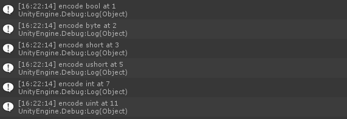

# BinaryBundle

[中文版說明](./README_tc.md)

Unity C# Binary Packing.

It introduces no new data format, only pre-generating encode and decode methods which reduce manually writing and improve performance.

It can be used as network format or local storage.

## Compatibility

Only tested with below versions but may be compatible with other versions.

| Version
|------
| Unity 2018.4.x
| Unity 2020.3.x

## Usage

Use whole project or copy `Assets/Scripts/BinaryBundle` to your project

## Data Definition

```csharp
using BinaryBundle;

// Add BinaryBundleObject to type
[BinaryBundleObject]
// Use partial keyword
public partial class TestClass {
    // Add BinaryBundleField to membera which want to be serialized, the number behind means order.
    [BinaryBundleField(0)]
    public int fieldInt;

    [BinaryBundleField(1)]
    public string fieldString;

    [BinaryBundleField(2)]
    public float fieldFloat { get; set; }

    // Add default Constructor
    public TestClass() {}
}
```

## Supported Type

Only support basic type, struct and class, but you can extend it through custom serialization.

| Type           |                              |
|----------------|------------------------------|
| bool           |                              |
| byte           |                              |
| sbyte          |                              |
| short          |                              |
| ushort         |                              |
| int            |                              |
| uint           |                              |
| long           |                              |
| ulong          |                              |
| float          |                              |
| double         |                              |
| string         |                              |
| Enum           | Depend on UnderlyingType     |
| T[]            | T is supported type          |
| List\<T\>      | T is supported type          |
| Dictionary<K,V>| K, V are supported type      |
| Struct         | should be BinaryBundleObject |
| Class          | should be BinaryBundleObject |

## Generate Code

To avoid any reflection, it uses pre code generating, so it also has some limitation.

After defining the types, use the following method to generate code.(For details please refer `BinaryBundle.Test/TestRunner.cs`)。

```csharp
void BinaryBundleSerializer.GenerateCode(string outputpath, Type[] types)
```

If you have compilation errors, please remember:

+ Type sholuld have `partial` keyword

    Because it use `partial` to extend the type methods

+ No support Generic Type definition

    There are some internal problems when dealing with generic.

+ Add Constructor when needed

    Because the generated code will contain new Constructor.
    If you rely on default constructor compiler generated for you, you should define it manually.

    ```csharp
    public YourClass() {}
    ```

The generated code can be see at `BinaryBundle.Test\Generated\Generated.cs`

```csharp
#define USE_TEST_CLASS

namespace BinaryBundleTest {
    partial class TestClass : IBinaryBundleSerializable {

        // Deserialization Constructor
        public TestClass(byte[] bytes, ref int offset)  {
#if USE_TEST_CLASS
            var __Int32_1 = default(Int32);
			var __String_1 = default(String);

			// fieldInt
			if(!BinaryBundleInternal.DecodeInt(bytes, ref offset, ref __Int32_1)) throw new DecodeBinaryBundleException("fieldInt", offset);
			fieldInt = __Int32_1;
			// fieldString
			if(!BinaryBundleInternal.DecodeString(bytes, ref offset, ref __String_1)) throw new DecodeBinaryBundleException("fieldString", offset);
			fieldString = __String_1;
#endif
        }

        // Serialization Method
        public virtual void __BinaryBundleSerialize(List<byte> bytes) {
#if USE_TEST_CLASS
            // fieldInt
			BinaryBundleInternal.EncodeInt(bytes, fieldInt);
			// fieldString
			BinaryBundleInternal.EncodeString(bytes, fieldString);
#endif
        }
    }
}

```

※ Tips: If you want to change type format, you can comment the define on the top to avoid compilation errors.(ex: USE_TEST_CLASS)

## Usage

```csharp
// Serialization
byte[] BinaryBundleSerializer.Encode<T>(T target);
// Deserialization
T BinaryBundleSerializer.Decode<T>(byte[] bytes);
```

```csharp
using BinaryBundle;

TestClass inst = new TestClass();

// Serialization
byte[] bytes = BinaryBundleSerializer.Encode<TestClass>(this);

// Deserialization
TestClass reversed;
try {
    reversed = BinaryBundleSerializer.Decode<TestClass>(bytes);
}
catch(DecodeBinaryBundleException e) {
    UnityEngine.Debug.LogError("Deserialize failed " + e.Message);
    return;
}
```

## Callback

Implements `IBinaryBundleSerializationCallback` interface (code should regenerated)

```csharp
[BinaryPackObject]
public class TestClass : IBinaryPackSerializationCallback {

    public void OnBeforeSerialize() {}
        
    public void OnAfterDeserialize() {}
}
```

※ If the inherited type also has callback, if will call first.

## Custom Serialization

To deal with types that we can't add `BinaryBundleObject` attribute, you can implement your own serialization method.

Add a new serialization static class and implementation `Serialize` and `Deserialize`.

```csharp
public static class Vector2IntSerializer {
    // Serialization
    public static void Serialize(Vector2Int data, List<byte> bytes) {
        BinaryBundleInternal.EncodeBool(bytes, true);
        BinaryBundleInternal.EncodeInt(bytes, data.x);
        BinaryBundleInternal.EncodeInt(bytes, data.y);
    }
    // Deserialization
    public static Vector2Int Deserialize(byte[] bytes, ref int offset) {
        bool exist = false;
        int x = 0, y = 0;
        if (!BinaryBundleInternal.DecodeBool(bytes, ref offset, ref exist)) Error(offset);
        if (exist) {
            if (!BinaryBundleInternal.DecodeInt(bytes, ref offset, ref x)) Error(offset);
            if (!BinaryBundleInternal.DecodeInt(bytes, ref offset, ref y)) Error(offset);
        }
        return new Vector2Int(x, y);
    }

    private static void Error(int offset) {
        throw new DecodeBinaryBundleException(typeof(Vector2Int).ToString(), offset);
    }
}
```

Add `BinaryBundleCustomSerializer` to specify the type and the corresponding serializer.

```csharp
[BinaryBundleObject]
[BinaryBundleCustomSerializer(typeof(Vector2Int), typeof(Vector2IntSerializer))]
public partial class TestClass {
    [BinaryBundleField(0)]
    public Vector2Int a1;
    [BinaryBundleField(0)]
    public List<Vector2Int> a2;

    public TestClass() {}
}
```

## Version Control

A limited version control, it can serialize members depend on version.

```csharp
// BinaryBundleObject(version, minimum version)
[BinaryBundleObject(3, 1)]
public sealed partial class Test {
    // BinaryBundleField(order, minimum version, maximum version)
    [BinaryBundleField(0, 1, 2)]
    public int a1;

    // no parameter means in all versions
    [BinaryBundleField(0)]
    public List<string> a2;

    public Test() {}
}
```

## Low Level API

If you want to deal with bytes yourself, you can use the internal methods.

```csharp
using BinaryBundle.Internal;

BinaryBundleInternal.EncodeBool(List<byte> bytes, bool data);
BinaryBundleInternal.EncodeByte(List<byte> bytes, byte data);
BinaryBundleInternal.EncodeSByte(List<byte> bytes, sbyte data);
BinaryBundleInternal.EncodeShort(List<byte> bytes, short data);
BinaryBundleInternal.EncodeUShort(List<byte> bytes, ushort data);
BinaryBundleInternal.EncodeInt(List<byte> bytes, int data);
BinaryBundleInternal.EncodeUInt(List<byte> bytes, uint data);
BinaryBundleInternal.EncodeLong(List<byte> bytes, long data);
BinaryBundleInternal.EncodeULong(List<byte> bytes, ulong data);
BinaryBundleInternal.EncodeFloat(List<byte> bytes, float data);
BinaryBundleInternal.EncodeDouble(List<byte> bytes, double data);
BinaryBundleInternal.EncodeString(List<byte> bytes, string data, Encoding encoding = null);

BinaryBundleInternal.DecodeBool(byte[] bytes, ref int offset, ref bool data);
BinaryBundleInternal.DecodeByte(byte[] bytes, ref int offset, ref byte data);
BinaryBundleInternal.DecodeSByte(byte[] bytes, ref int offset, ref sbyte data);
BinaryBundleInternal.DecodeShort(byte[] bytes, ref int offset, ref short data);
BinaryBundleInternal.DecodeUShort(byte[] bytes, ref int offset, ref ushort data);
BinaryBundleInternal.DecodeInt(byte[] bytes, ref int offset, ref int data);
BinaryBundleInternal.DecodeUInt(byte[] bytes, ref int offset, ref uint data);
BinaryBundleInternal.DecodeLong(byte[] bytes, ref int offset, ref long data);
BinaryBundleInternal.DecodeULong(byte[] bytes, ref int offset, ref ulong data);
BinaryBundleInternal.DecodeFloat(byte[] bytes, ref int offset, ref float data);
BinaryBundleInternal.DecodeDouble(byte[] bytes, ref int offset, ref double data);
BinaryBundleInternal.DecodeString(byte[] bytes, ref int offset, ref string data, Encoding encoding = null);
```

## Debug

To see full encode/decode messages, you can define `BINARY_BUNDLE_DEBUG`



## Thread Safe

To use in multi-thread please define `BINARY_BUNDLE_THREAD_SAFE` to avoid thread conflictions.

## Test

Test project is in `BinaryBundle.Test`

+ Unity Menu `Window/BinaryBundle/Test/Generate Code` to generate code.

+ Unity Menu `Window/BinaryBundle/Test/Run Test` to run test.